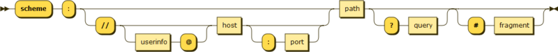

> Every time, when you want to find something on google, youl type [https://www.google.com](https://www.google.com/) In that bar. You can find the **URL** of Google is **https**://**www**.google.com But what's the meaning of these series of things?

+ **World Wide Web**

  World Wide Web is the reason why you are able to see this blog. It connects people's web browser with servers. *That's all the things you need to know about World Wide Web in this Tutorial.*

  *If you want to know more about WorldWideWeb:*

  *https://www.techopedia.com/definition/5217/world-wide-web-www*

  *https://webfoundation.org/about/vision/history-of-the-web/*

  

+ **HTTP**

  HTTP (Hypertext Transfer Protocol) is the underlying protocol used by the World Wide Web, and this protocol defines how messages are transmitted and how browser reacts to your action. 

  **That's all the things you need to know about HTTP in this Tutorial.**

  *For more information:*

  *https://www.webopedia.com/TERM/H/HTTP.html*

+ **URL**

  > **Uniform Resource Locator** (**URL**), colloquially termed a **web address**,[[1\]](https://en.wikipedia.org/wiki/URL#cite_note-FOOTNOTEW3C2009-1) is a reference to a [web resource](https://en.wikipedia.org/wiki/Web_resource) that specifies its location on a [computer network](https://en.wikipedia.org/wiki/Computer_network) and a mechanism for retrieving it. A URL is a specific type of [Uniform Resource Identifier](https://en.wikipedia.org/wiki/Uniform_Resource_Identifier) (URI),[[2\]](https://en.wikipedia.org/wiki/URL#cite_note-2)[[3\]](https://en.wikipedia.org/wiki/URL#cite_note-FOOTNOTERFC_39862005-3) although many people use the two terms interchangeably.----Wikipedia

  URL is a way that helps us understand and remember the web address. URL is critical in web-spider.

  First of all, we need to understand the ***syntax of URL*** ---- Every Http URL uses the syntax of generic URI

  > ***URI = scheme:[//authority]path\[?query][#fragment]***

  Authority components divides into three subcomponents:	

  > ***authority = [userinfo@]host[:port]***

In next tutorial, I will tell you more about the URL components and how will it help you in Spider.

Thanks for reading & happy coding (~~though we haven't started coding yet~~)