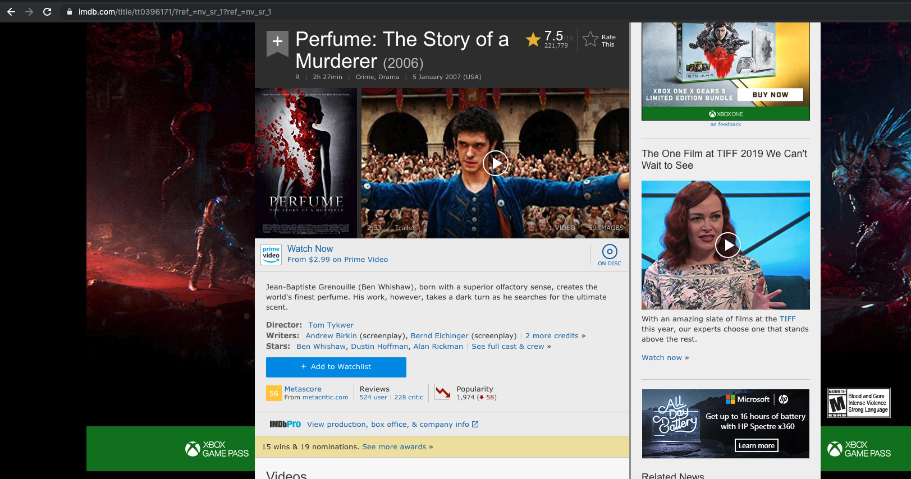
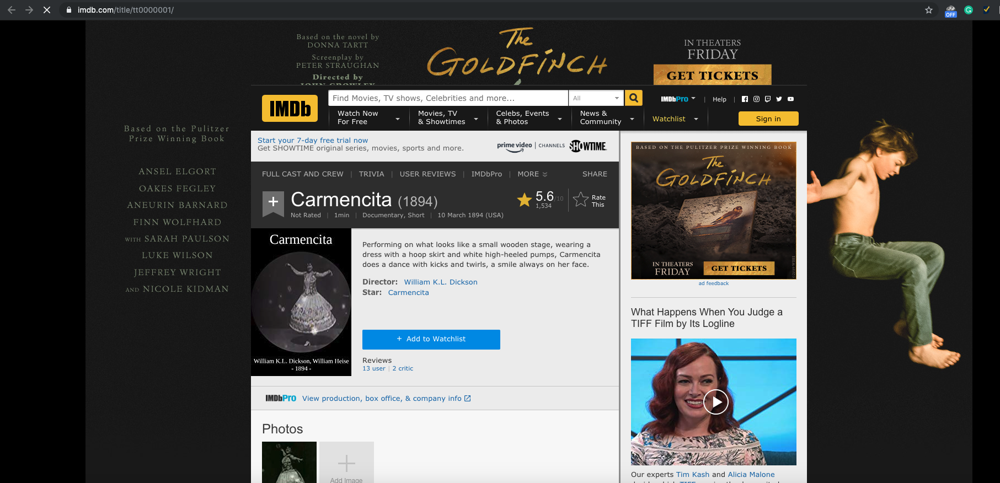
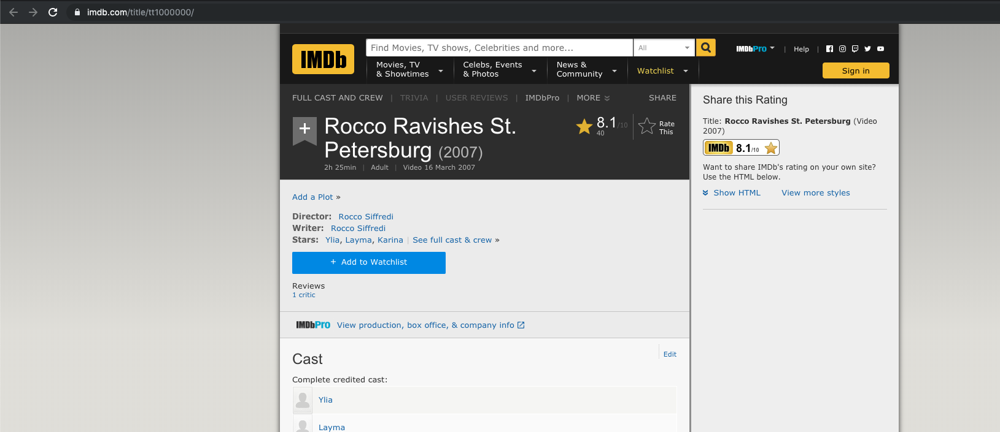
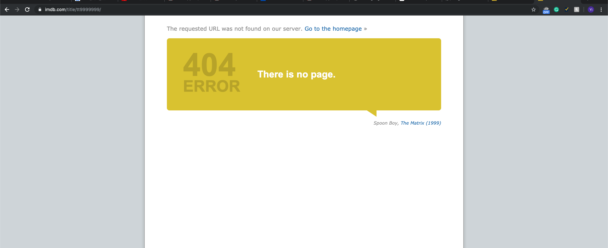
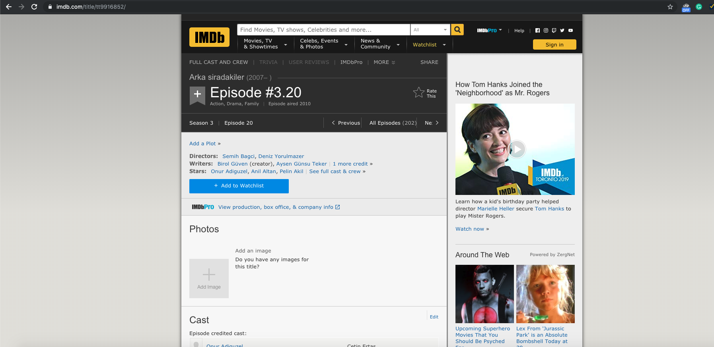

### The use of URL in Web-Spider

We need URLs to tell our program which website should it go, but how to do that?

> I found my favorite film (Perfume) on IMDB. (Highly recommend that) I will use that page to show you the use of URL in Web-Spider.
>
> After I search the movie name "Perfume" in the bar, I get:
>
> > https://www.imdb.com/title/tt0396171/?ref_=nv_sr_1?ref_=nv_sr_1
>
> After we discard the optional Query part... we get:
>
> > https://www.imdb.com/title/tt0396171/
>
> 
>
> Which is still the same page
>
> **Do you notice the path?** -- tt0396171
>
> Let's try to increase the number of it
>
> > https://www.imdb.com/title/tt0396172/
>
> 
>
> Umm... Let's see the previous one
>
> > https://www.imdb.com/title/tt0396170/
>
> 
>
> Let's see the #1 film listed:
>
> > https://www.imdb.com/title/tt0000001/
>
> 
>
> What about the #1000000 film listed:
>
> > https://www.imdb.com/title/tt1000000/
>
> 
>
> **To start web crawling, we need to know how many pages does this website has.
>
> \#9000000:
>
> > https://www.imdb.com/title/tt9000000/
>
> 
>
> Let's Try #9999999 film:
>
> > https://www.imdb.com/title/tt9999999/
>
> We got a 404
>
> 
>
> So let's find the Maximum Value
>
> ***Boom*** (Some magic here)
>
> The maximum number is: https://www.imdb.com/title/tt9916852/
>
> 

**Finally, we get the number of pages we need to crawl from the web**.

When I start to code, I will create a 9916852 times loop to get all the data from IMDB.

***That's basically all the things you need to learn about URL in this Tutorial.***

***Happy Coding, have fun.***

