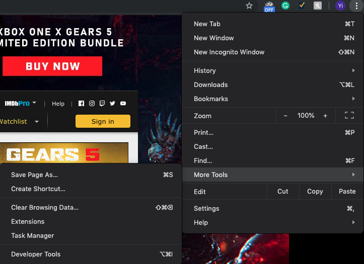
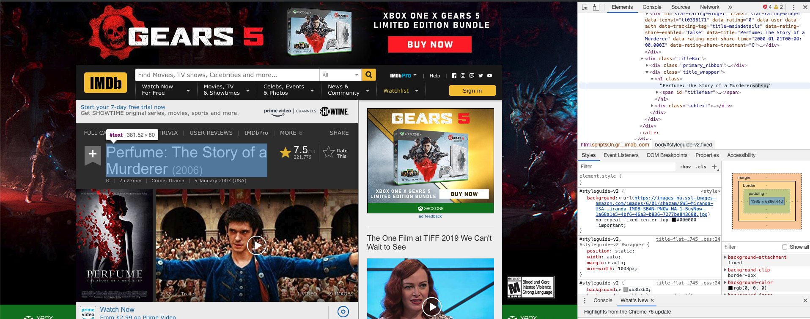

***Google chrome is a great developer tool, and I highly recommend you use that***

> Every time when you open a web page, have you ever curious about what's the secret behind that beautiful web page? 

Everything you see on the web page is written by **HTML(Hyper Text Markup Language)**. HTML, however, is not a coding language. It is a  **Markup language**.

In HTML, we use **HTML tags** to describe a Web page.

> + HTML tags is placed between a pair of \<>. For example: \<html>
>
> + Usually HTML tags come in pairs like \<p> \</p>
>
> + The former is called start tag, and the latter is called the end tag
>
>   Example:
>
>   >```<html>```
>   >
>   >```<body>```
>   >
>   >```<h1> This is a Header </h1>```
>   >
>   >```<p>This is a Paragraph</p>```
>   >
>   >```</body>```
>   >
>   >```</html>```
>
> + Contents inside \<html> and \</html> describe the web page
>
> + Contents between \<body> and \</body> can be shown on the web page
>
> + Headers locates between \<h1> and \</h1>
>
> + Contents between \<p> and \</p> represents a paragraph

## How to check the HTML file of a Web page?

1. Open the Developer Tools

   

2. Then, you can see the HTML files on the right part of your browser. When you put your mouse on the tags, Chrome can show you which part of the Web Page that this tag is describing.

   

There are many tags in HTML, and you don't have to remember all of them for Web Crawling.

You can search the HTML tags on this Web Site: https://www.w3schools.com/tags/default.asp

To learn more about HTML, you can go to: https://www.w3schools.com/html/default.asp

I will discuss more HTML knowledge that is essential for Web Crawling in next turotial.

Happy coding. Have fun!


