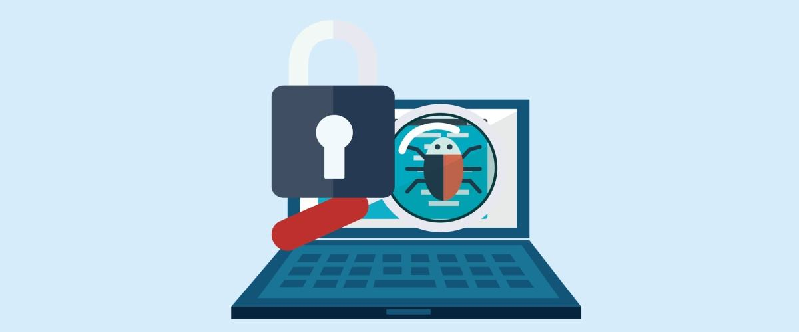

**Chill, Calm down, ** I know you have many questions like *"We haven't learned how to web crawling, ~~WhatTheHack~~ is Anti-Spider."* 

 **To defeat your enemies, you need to know them well**

***For some web developers, we, the web crawler makers, are thefts*** ~~it's hard to admit, but we are data thefts~~. Some developers may not care about that, but our massive, high-speed site-visiting does increase the probability of **Server's overload**.

For whatever reason, web developers ***block us from taking their data***. They use Anti-Spider to keep our program out. By learning the way those developers block us from getting their data, we can have a general concept of **How** to crawl a web accurately. *(Please beware of the source you want to crawl, using data from some of the website can be illegal)*   

> #### Ways of Anti-Spider
>
> 1. **Recognize you and Block you**
>
>    If you don't hide your ip or your program, the developers can easily target on your spider program. They can just block you easily.
>
> 2. **Encoding**
>
>    Some web developer encodes their data. In this case, you usually get a bunch of useless nonsense. This method blocks the web-spider from **getting the correct data.**	 
>
> 3. **Login & Verification**
>
>    You probably notice that you usually need to do some verification to prove that you are not a bot when you try to sign in to some website. This is a way of protection, and **it blocks your program if you don't know how to let your spider login to their site.**
>
> 4. **Restrict Visit Speed**
>
>    Web-Spider is a powerful machine that **visits and gets data at high-speed frequency**. However, some smart developer can block your program by shooting a 403 page.

**In General, there are three parts in Web-Spider technique.**

1. Access The Site
2. Select & Grab Data
3. Repeat 1 & 2 

At the end of this whole series of tutorial, there will be a Anti-Anti-Spider Tutorial don't miss that!!!!!

Enjoy Coding!

