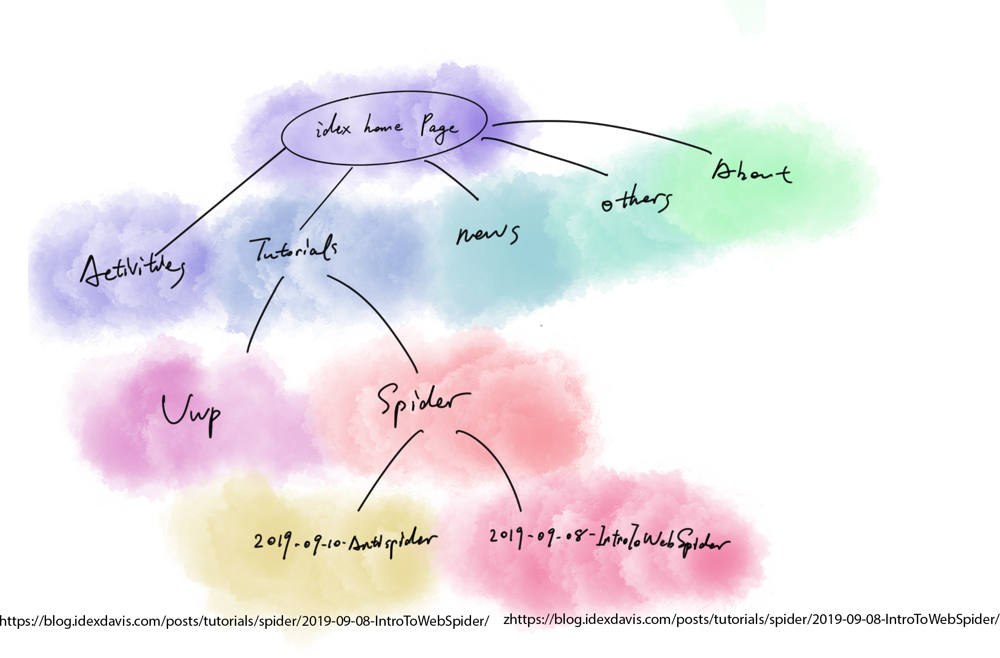

>From last tutorial we mentioned that:
>
>*URI = scheme:[//authority]path\[?query][#fragment]*
>
>*authority = [userinfo@]host[:port]*

* ***Scheme***

  ​	Scheme is the place let you fill in which protocol (Like Http) you want to use to request data from the server.

* ***Userinfo*** (optional)

  ​	Some server and protocol (Like FTP - File Transfer Protocol) requires user info and password to access. In that case, we need to fill in the user info part like **username:mypassword@**. ":" separate the username and the password, and @ seperate the user info and other information.

* ***Host & Port*** (optional)

  ​	Host in URL indicates the host machine that can access the server. You can use the host machine's registered name or IP address to fill in this place.

  ​	Port Indicates the web port that the server is monitoring.

* ***Path***

  ​	Path is the information that helps the server target the asset you want. It is just like the path in your computer. 

  > https://blog.idexdavis.com/posts/tutorials/spider/2019-09-10-AntiSpider/
  >
  > This is the URL of my second web-spider tutorial.
  >
  > Let's see how this "path" Stuff Work on our Blog
  >
  > 

  ​	**Path is the most important thing we need to know about in URL for web-Spider**

* **Query** (optional)

  > https://www.google.com/search?q=UC+Davis&rlz=1C5CHFA_enUS844US844&oq=UC+Davis&aqs=chrome..69i57j69i59l2j69i61j69i60l2.5729j0j9&sourceid=chrome&ie=UTF-8
  >
  > This is the URL when I am trying to search UC Davis on Google, and we can find **search?q=UC+Davis** in that. 

  ​	Query is preceded by a question mark (**?**). The searching part of the URL is right after question mark.

* **Fragment**

   	We can find the fragment after **#**. This indicates a part of HTML page. Usually, when you use the navigation function in a web page, the HTML will use this #fragment to lead you there.

  ​	*We will talk about that later in HTML Tutorial*

***Great! That's all the knowledge you need to know about URL before start coding!***

Next Tutorial will talk about the use of URL in Web-Spider. It will be extremely Interesting!

Happy Coding Have fun!

