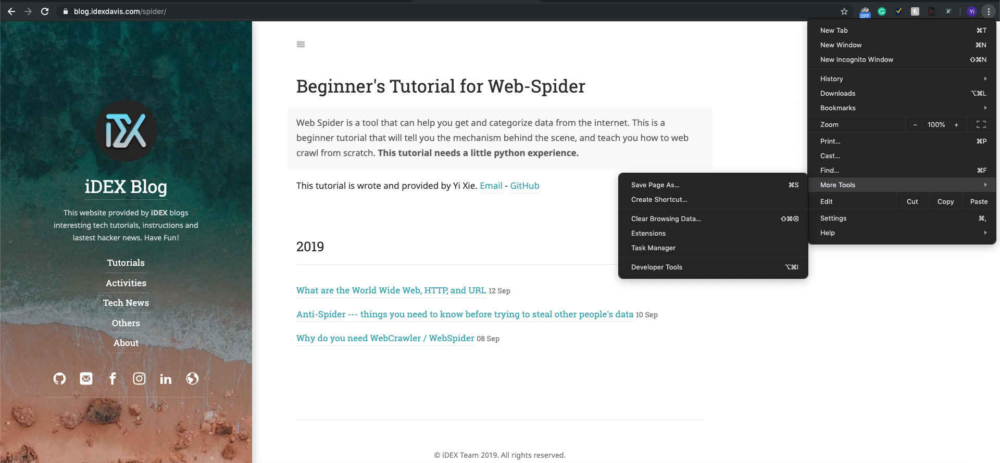
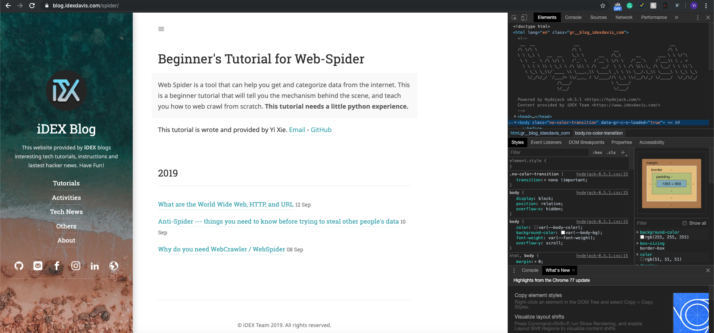
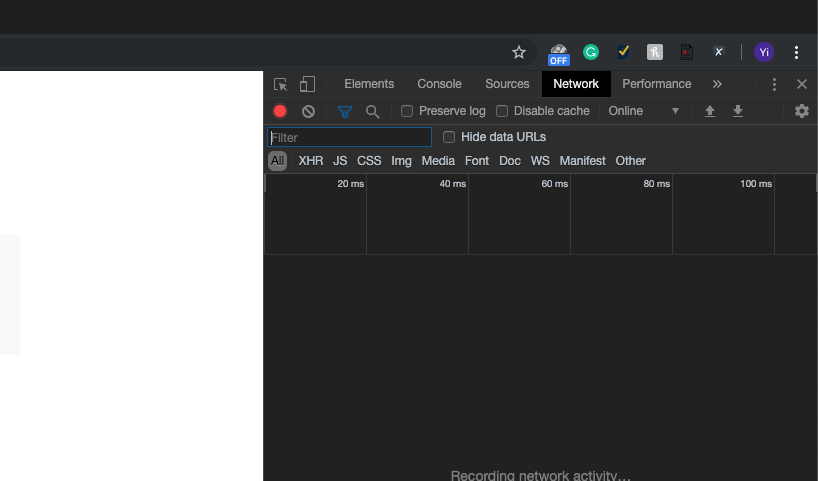
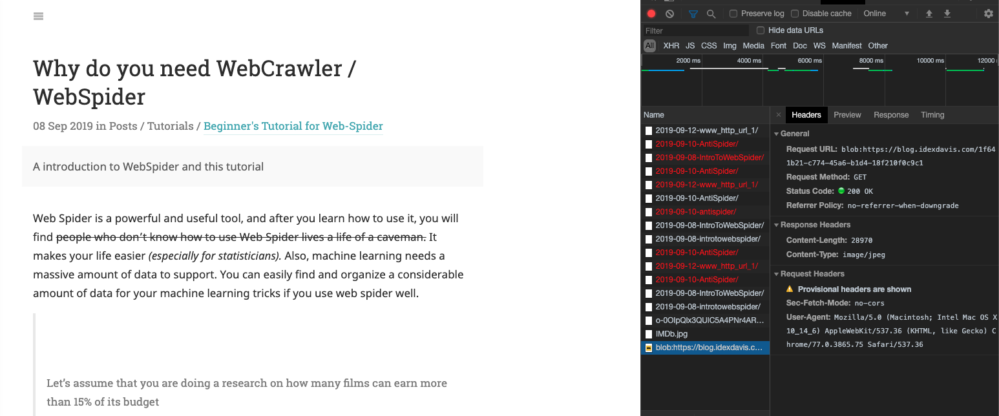

Now, we know the syntax of URLs, then what?
Here is [a link to iDEX blog](https://blog.idexdavis.com/)
After you click that, you will be directed to the home of iDEX Blog.
While directing, there are a couple of operations happening.

> **Start** -> **Browser get the URL** -> **Check if the URL exists**
> if URL does not exist -> **Error: Cannot find the IP address of the server**
> if URL exists -> Use **DNS** to get IP address of the server -> **Send http request to server** -> **get http response from server** -> **Browser analyze the http responses and display the Web Page**
> **End**

###What is DNS
> The Domain Name Systems (DNS) is the phonebook of the Internet. Humans access information online through domain names, like nytimes.com or espn.com. Web browsers interact through Internet Protocol (IP) addresses. DNS translates domain names to [IP addresses](https://www.cloudflare.com/learning/dns/glossary/what-is-my-ip-address/) so browsers can load Internet resources.
>
> Each device connected to the Internet has a unique IP address which other machines use to find the device. DNS servers eliminate the need for humans to memorize IP addresses such as 192.168.1.1 (in IPv4), or more complex newer alphanumeric IP addresses such as 2400:cb00:2048:1::c629:d7a2 (in IPv6).     
>
> ----[CloudFlare](https://www.cloudflare.com/learning/dns/what-is-dns/)

### HTTP requests & responses
HTTP requests & response make an HTTP request complete.
#### Requests
An HTTP request is a searching requests that our client(Browser, web-spider, etc.) send. 
It includes:

> Request headers: URL, client's cookies, client's UserAgent, request method, parameters (forms)
> Requests body: data that need to send to server (not shown to users)

#### Response 
Response is the content that the server return to us. 
>Response Headers include: commands that can operate the cookies of clients.
>Response Body includes: web content, JavaScript Code, css code, files

##### HTML Standard Response Code

Here are some useful codes: (Descrption credit to [Wikipedia](https://en.wikipedia.org/wiki/List_of_HTTP_status_codes))

+ 200 OK: 

  Standard response for successful HTTP requests. The actual response will depend on the request method used. In a GET request, the response will contain an entity corresponding to the requested resource. In a POST request, the response will contain an entity describing or containing the result of the action.[[9\]](https://en.wikipedia.org/wiki/List_of_HTTP_status_codes#cite_note-RFC_2616-10)

+ 302 Found:

  Tells the client to look at (browse to) another URL. 302 has been superseded by 303 and 307. This is an example of industry practice contradicting the standard. The HTTP/1.0 specification (RFC 1945) required the client to perform a temporary redirect (the original describing phrase was "Moved Temporarily"),[[22\]](https://en.wikipedia.org/wiki/List_of_HTTP_status_codes#cite_note-RFC_1945-23) but popular browsers implemented 302 with the functionality of a 303 See Other. Therefore, HTTP/1.1 added status codes 303 and 307 to distinguish between the two behaviours.[[23\]](https://en.wikipedia.org/wiki/List_of_HTTP_status_codes#cite_note-RFC7230-10-24) However, some Web applications and frameworks use the 302 status code as if it were the 303.[[24\]](https://en.wikipedia.org/wiki/List_of_HTTP_status_codes#cite_note-ruby-on-rails-ActionController-Redirecting-redirect_to-25)

+ 403 Forbidden:

  The request was valid, but the server is refusing action. The user might not have the necessary permissions for a resource, or may need an account of some sort. This code is also typically used if the request provided authentication via the WWW-Authenticate header field, but the server did not accept that authentication.

+ 404 Not Found:

  The requested resource could not be found but may be available in the future. Subsequent requests by the client are permissible.

### How to inspect request & response information?
+ Use Google Chrome open whatever web page you want to open

+ Press ```F12``` or settings -> More Tools -> Developer Tools

  

+ you can find the Web content in HTML in this page
  

+ you can find the request header by selecting Network tab

  
  
  
  
    