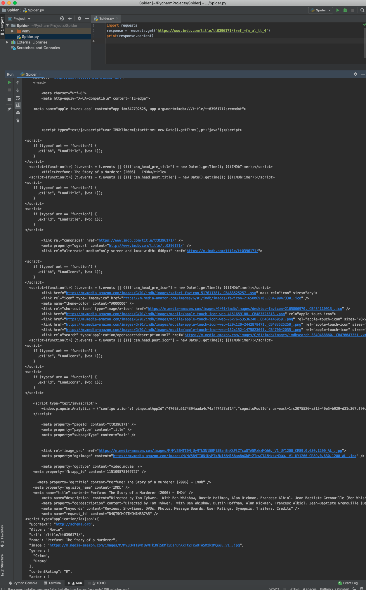
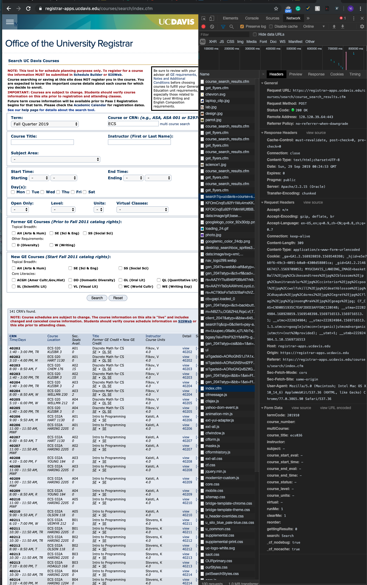

---
layout:post
title:Requests Library: get & post
description: >
    Basic methods in Python library --> requests
---


#### Source Code

- If you want to inspect the source code of requests: git clone git://[github.com/kennethreitz/requests.git](http://github.com/kennethreitz/requests.git)

### Quick Start

#### Use Requests Get Web Page

- First, we need to import requests
- import requests
- Then, let's try to use **get to get a web page：**
- **response = requests. get("https://blog.idexdavis.com/tutorials/")**
- **Variable Response now becomes a Response object. It stores the Response from the WebPage**

#### **How to get the HTML Source Code of the page?**

- **response = requests.get('https://www.imdb.com/title/tt0396171/?ref_=fn_al_tt_4')**

- You can try to inspect the HTML Source code using

  > '''print(response.content)'''

   

Here, we get the HTML code of [https://www.imdb.com/title/tt0396171/?ref_=fn_al_tt_4](https://www.imdb.com/title/tt0396171/?ref_=fn_al_tt_4) 

However, you will found that some time you need to submit forms to get more information. In this situation, we can use **```post```**to do that

The ```post()``` method sends a POST request to the specified url

**Syntax**

> requests.post(*url*, data={*key*: *value*}, json={*key*: *value*}, *args*)

It is very difficult to get the information we want by using ```post``` on webPage like UCDavis's course search tool because UCDavis's course search tool is a dynamic webpage relying on **Javascript**, which need some time to proceed the input information. However, ```post``` returns the response immediately that the information we want on the webpage hasn't shown.



Nowadays, Most of the webpage you want to crawl is a dynamic webpage, so people use post method less and less. **I will discuss more about the alternative methods of web crawling later**